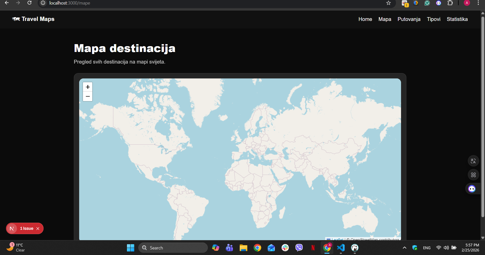
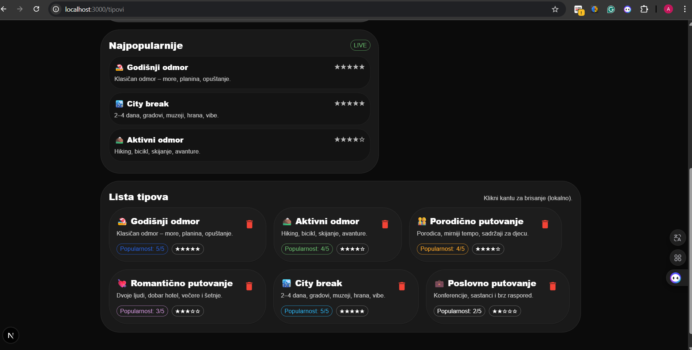
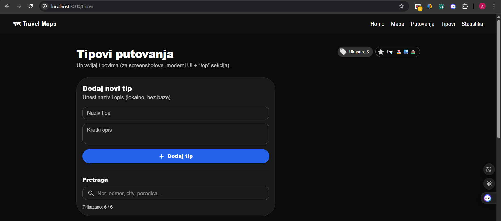
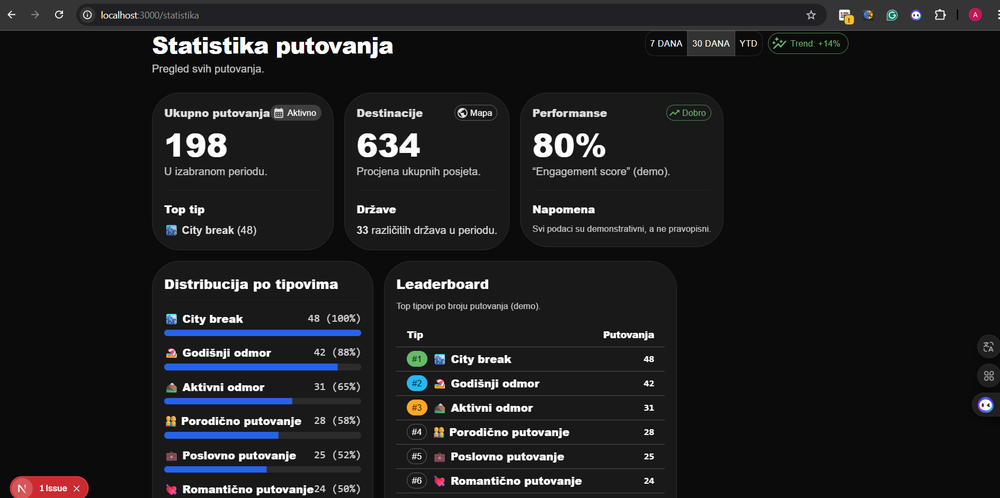

# 🗺️ Travel Maps

React + Next.js frontend aplikacija za prikaz i upravljanje putovanjima i destinacijama.

Ovaj repozitorij sadrži **frontend** aplikaciju izrađenu u okviru projekta za predmet Dinamički web sistemi.

---

## 📌 Pregled aplikacije (Screenshots)

### 🏠 Početna stranica


### 🗺️ Mapa destinacija


### ✈️ Putovanja


### 🏷️ Tipovi putovanja


### ➕ Dodavanje tipa putovanja


### 📊 Statistika


---

## 🧰 Tehnologije

Frontend aplikacija koristi:

- 🧠 **Next.js**  
- ⚛️ **React** (Client components)  
- 🎨 **Material UI**  
- 🗺️ **react-leaflet / Leaflet** (interaktivna mapa)
- ✨ Tamna tema + UI komponente za lep izgled

> Backend API (FastAPI) **nije** u ovom repozitoriju — frontend očekuje da backend radi na `http://localhost:8000`.

---

## 🛠️ Pokretanje Frontenda lokalno

Ako želiš pokrenuti samo frontend:

1. Otvori repozitorij lokalno i uđi u folder:

```bash
cd mape/frontend